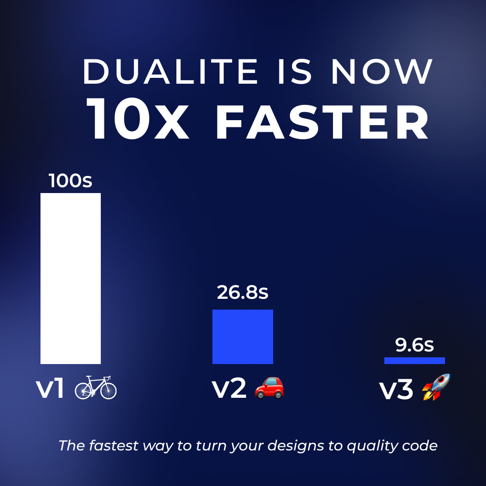

# Dualite Plugin - User Documentation

## Overview

Our tool converts static and interactive Figma designs to React and HTML/CSS to an almost pixel-perfect extent. Our tool supports various types of linear Frame-to-Frame prototyping interactive prototyping Figma flows.
  
For either type, you just need to start by selecting the Static Frame or the Starting Frame of the flow(Interactive Prototype). For Static Designs, you get the option of copying the code. If you’re converting an interactive prototype into code, you'll also get animation scripts (javascript) that'll be responsible for animation's control flow.
 
 
You can just copy & paste the generated code in your project.
We’ve also provided a direct **_‘Preview in Code Sandbox’_** option that lets you skip the copy-paste effort and directly makes you preview the result as well as the encompassing code.

## What's new in beta_v3

We've added a lot of new features and improved the existing ones. We've also improved the overall performance of the plugin quite a lot.

- React and HTML conversion, both with Vanilla CSS.
- Figma Prototypes (even more complicated ones) to CSS Animations (KeyFrames).
- Figma Dev Mode support.
- Optimized image conversion process and internal algorithms, that has reduced the conversion time by upto 10x.
- Optimized Linear prototyping to CSS animations logic.
- Overall faster conversions in beta_v3, compared to beta_v2.
    
  
    
- You can now report issues and give us your feedback on this github repository.
- Improved new UI.
- Bug Fixes: Some commonly faced issues with Instances have been fixed along with some other issues found in internal testing and user feedbacks.
- We've also added a new feature that allows you to convert another design without closing the plugin, saving you a lot of time and effort.

## Things to keep in mind (for designers)

As designers, there are some minor changes and guidelines, which will make the generated code much better and easily integratable. Here are some tips.

1. **Use fonts that are available on Google Fonts.** 
   We use Google Fonts for the generated code. So, if you use a font that is not available on Google Fonts, it will be replaced by the default font, which is Times New Roman. You can check the list of fonts available on Google Fonts [here](https://fonts.google.com/).
      If you want to use a font that is not available on Google Fonts, your developer can add the font manually in the code. For that, you need to download the font and add it to your project. You can check out the steps to do that [here](https://www.w3schools.com/css/css3_fonts.asp).
2. **Font Size mismatches** 
   The font size displayed in Figma can be larger than the actual browser. This is an inherent Figma issue and not a Dualite issue.   
   
    
    
   You can solve the above to a certain extent by going within the Figma desktop app.   
   **View > Interface Scale > Reset to Default**
    
   Fonts should now look the same as in the browser.
3. **Group Rotations** 
   We're working on handling all sorts of group rotations and flips in the upcoming updates. For now, we recommend you to avoid using group rotations and flips, hence if you face any issues with the generated code, you can try changing that group to frame and then try again.  
   If you're still facing any complicated issue, you can export that frame/group as an image and then use that image in your code.
4. **Naming in Interactive Prototypes** 
   Naming is important for the identification of elements in any interactive prototyping, especially if your flow is dealing with Smart-Animate transitions between frames.
    
   
    
    
   The naming of any elements or ‘nodes’ _inside_ the parent Frame involved in the transition entirely or a part of the transition should have the following properties:

   - consistent naming of the animating/transitioning element throughout the flow
   - the element name must be unique and should not be identical to any other element involved in the transition.

     
   
    

<!-- 5. **Trigger** 
   Whatever element/group/sub-frame inside a Parent Frame the trigger is put to, it is recommended that the element/group/sub-frame be at the top inside the overall order or collection if it's the direct child of the parent frame or at the top of the corresponding order inside any child or sub-child of the parent frame. -->

## Using the generated code (for developers)

Here we'll be discussing how you can use Dualite for production applications or you next personal project. We've tried to make the generated code as simple as possible. You can just copy & paste the code in your project and it'll work. But there are some things that you should keep in mind.

1. **Fonts**  
   If you want to use a font that is not available on Google Fonts, you can add the font manually in the code. For that, you need to download the font and add it to your project. You can check out the steps to do that [here](https://www.w3schools.com/css/css3_fonts.asp).   
2. **Animations** 
   We use CSS animations for the generated code. So, you don't need to add any animation library manually. We use the JavaScript code for controlling the animations. So, if you want to add any animation manually, you can do that by adding the animation class manually and then controlling it using the JavaScript code. You can check out the steps to do that [here](https://www.w3schools.com/css/css3_animations.asp).  
3. **Positioning** 
   We use absolute positioning as of now for the generated code. So, if you want to add any element manually, you can do that by adding the element manually and then positioning it using the CSS code.
    
   We've already added a wrapper div ("parent-div") for the entire code. So, you can just position that wrapper div and all the elements inside it will be positioned accordingly.  
4. **Images** 
   For smaller vectors/shapes (under 50kB) we use base64 encoding. For larger images, we use AWS S3 & Firebase. We recommend to transfer all assets locally or to your own cloud hosting service for production applications. We'll be soon adding an option to download all assets and code as a zip file.
     
5. **Shadows** 
   We use box-shadow for the generated code. So, if you need to add a non-boxed shadow, you can do that with filter: drop-shadow() property. You can check out the steps to do that [here](https://www.w3schools.com/cssref/css3_pr_filter.asp).
   We're not using this currently because of browser compatibility issues and no support for spread and inset shadows. We'll be adding support for this in the future. 

## How to use the plugin?

We've tried to make the plugin as simple as possible. You can just follow the steps below to use the plugin.
  

<!-- ## Future Updates

We're here with a long term vision. We're working on a lot of new features and improvements. Here are some of the things that we're working on.

- **Download as a zip file**  
  We'll be soon adding an option to download all assets and code as a zip file.
- **Components and Variants based animations**  
  We currently do not support Components and Variants-based Smart Animation transition. However, we fully support and generate code for any Figma component in static designs. We are actively developing support for interactive components and variants.
- **Support for more frameworks**  
  We currently support React.js and HTML/CSS. We're working on adding support for more frameworks like Vue.js, Angular, Svelte, etc and mobile frameworks like Flutter and React Native in the future.
- **Responsive Design**  
  Currently our generated code uses absolute positioning. We're working on adding support for responsive design patterns like Flexbox and Grid in the future.  
  The other popular tools in the market use Flexbox to some extent, but their solution relys on how perfectly you've designed your Figma design and used auto-layouts, which indeed increases complexity on the designer's end. If you've designed your Figma design perfectly, then you'll get a good result. But if you've not designed your Figma design perfectly, then you'll get a bad result.  
  However, we're working on a more robust solution that will allow you to easily convert your designs to responsive code even with less reliance on auto-layouts.
- **Support for CSS frameworks**  
  We're working on adding support for CSS frameworks like Tailwind CSS, Bootstrap, Material UI, etc in the future.
- **Support for branched prototyping**  
  We're working on adding support for branched prototyping in the future. -->

#### Faced anything other than mentioned above? Tell us now by raising an Issue [here](https://github.com/dualiteindia/.github/issues).

## How we convert your designs to code?

🪜 800+ commits  
👩‍💻 15k+ Lines of code  
🧑🏻‍💻 4 developers (and their sleepless nights)  
🧠 Countless hours of brainstorming  

This has made Dualite the first plugin to convert interactive protoypes into quality React and HTML/CSS code.
 
Let's get you a sneak peak of how exactly Dualite works internally.

### Technology

- We use TypeScript, React.js, Redux and esBuild for the plugin and Next.js, React.js, Firebase, Express.js, MongoDB and AWS for essential services.

- We're using Figma's OAuth2 for user authentication. We use Figma's REST API and Plugin API for fetching the designs and other data like images, fonts, etc.

- We're using our in-house developed algorithms for the processing of your designs. These algorithms are written in TypeScript mainly.

- We're using esBuild for the processing of your designs. esBuild is a JavaScript bundler and minifier. It's fast, really fast. It's written in Go, which makes it faster than other JavaScript bundlers. It's also used by Figma internally for their plugin bundling.

### Architecture

We have developed a modular & scalable structure that allows us to easily add new features and framework support. The language independent processing is done seperately, after that our language/framework modules kick in based on user selection. This new architecture has improved our internal efficiency, enabling us to deliver better and faster updates in future.

## Want to share your thoughts?

We’ve tried our best to jot down the best practices, through which you can maximise the benefits of our design-to-code tool and effectively convert Figma interactive designs into functional code.

If you’re facing any other problems or queries, add an issue with "bug" or "issue" label here. We’ll get back to you as soon as possible. If you want to share your thoughts or feedback, add an issue with "feedback" label here.
  
Join our [Discord Server](https://discord.com/invite/uFA89PUV) to get the latest updates and to interact with the community.

