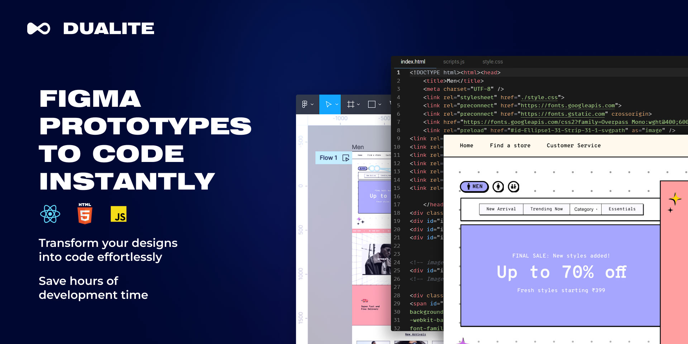

# Dualite beta_v3

Dualite is a powerful tool that seamlessly converts Figma interactive designs into code, pixel-perfect, providing developers with a streamlined workflow and reducing the time and effort required to bring interactive and animated designs to life.

## Connect with us

- [Figma Community](bit.ly/DUALITE)
- [Website](https://dualite.in)
- [Discord](https://discord.gg/uFA89PUV)
- [Twitter](https://twitter.com/dualiteindia)
- [Instagram](https://www.instagram.com/dualiteindia/)
- [LinkedIn](https://www.linkedin.com/company/dualiteindia)

## Documentation

[Here.](https://github.com/dualiteindia/.github/blob/main/documentation.md)
